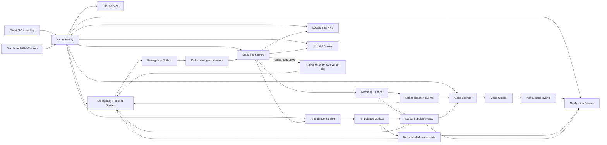

# Medical Emergency Coordination System

A distributed, event-driven medical emergency coordination platform built with Java 21, Spring Boot 4, Kafka, PostgreSQL, Redis, Docker Compose, Kubernetes, Prometheus, Grafana, and k6.

The platform covers the full emergency lifecycle: emergency intake, ambulance location simulation, a compensating dispatch saga that reserves the closest ambulance and a hospital bed, case creation, live emergency status tracking, paramedic pickup and delivery, hospital discharge, and real-time notifications over WebSocket. Access is controlled by JWT-based role checks at the API Gateway, and the project ships with Kubernetes manifests, HPA configuration, a Prometheus/Grafana observability stack, unit tests, CI, and a self-contained end-to-end check.



## Current Stack

| Layer | Technology |
| --- | --- |
| Backend | Java 21, Spring Boot 4 |
| Build | Maven multi-module project |
| API | REST through Spring Cloud Gateway |
| Auth | JWT login through `user-service`, admin-managed accounts, role and ambulance checks in `api-gateway` |
| Messaging | Apache Kafka, JSON events, retry topics and dead-letter topics |
| Databases | PostgreSQL per stateful service, Flyway migrations |
| Location cache | Redis |
| Real-time | WebSocket notification stream through the gateway |
| Reliability | Transactional outbox, idempotent consumers, compensating dispatch saga, stale-saga recovery |
| Containers | Docker Compose and per-service Dockerfiles |
| Orchestration | Kubernetes manifests under `k8s/` |
| Autoscaling | Matching Service HPA |
| Observability | Micrometer, Prometheus, Grafana, kube-state-metrics, k6 |
| Testing | JUnit 5, Mockito, AssertJ, end-to-end script, GitHub Actions CI |

## Services

| Service | Container port | K8s service | Responsibility |
| --- | ---: | --- | --- |
| API Gateway | 8080 | NodePort `30080` | Routes external API and WebSocket traffic and enforces JWT authorization |
| User Service | 8081 | `user-service` | Manages users, bootstraps the first admin, assigns paramedics to ambulances, and issues JWTs |
| Emergency Request Service | 8082 | `emergency-request-service` | Accepts emergencies, publishes `EmergencyRequestedEvent` through outbox, and tracks each emergency's lifecycle status |
| Ambulance Service | 8083 | `ambulance-service` | Stores ambulances, handles atomic reservation and release, and records paramedic pickups and deliveries |
| Location Service | 8084 | `location-service` | Simulates ambulance locations and stores latest coordinates in Redis |
| Matching Service | 8085 | `matching-service` | Consumes emergencies, selects the closest ambulance and hospital, runs the dispatch saga, and re-drives dead-lettered emergencies |
| Hospital Service | 8086 | `hospital-service` | Stores hospitals, reserves and releases beds by reservation key, and handles patient discharge |
| Case Service | 8087 | `case-service` | Correlates dispatch and hospital events into official cases |
| Notification Service | 8088 | `notification-service` | Consumes case and patient lifecycle events and streams notifications to connected dashboards |

In Docker Compose only the API Gateway is published on the host; every other service is reached through it.

## Roles

Accounts are created by an administrator. The first administrator is created automatically from `BOOTSTRAP_ADMIN_EMAIL` and `BOOTSTRAP_ADMIN_PASSWORD` when no admin exists yet.

| Role | Access |
| --- | --- |
| `ADMIN` | Everything: user management, ambulance and hospital registration, discharge, saga inspection, DLQ re-drive |
| `DISPATCHER` | Creates emergencies; reads emergencies, cases, ambulances, hospitals, and locations; receives live notifications |
| `PARAMEDIC` | Records pickup and delivery for the ambulance they are assigned to; reads emergency details; receives live notifications |

Paramedics are assigned to an ambulance with `PUT /api/auth/users/{id}/ambulance`. The assignment is carried in the paramedic's token, so it applies from their next login.

## Kafka Topics

Topics are defined in `shared/src/main/java/org/example/shared/config/KafkaTopics.java`.

| Topic | Main events |
| --- | --- |
| `emergency-events` | `EmergencyRequestedEvent` |
| `emergency-events-retry-*` | Delayed retries of emergencies whose dispatch attempt failed |
| `emergency-events-dlq` | Emergencies whose dispatch retries were exhausted |
| `dispatch-events` | `DispatchAssignedEvent` |
| `hospital-events` | `HospitalAssignedEvent`, `PatientDeliveredEvent` |
| `ambulance-events` | `PatientPickedUpEvent` |
| `location-events` | `AmbulanceLocationUpdatedEvent` |
| `case-events` | `CaseCreatedEvent` |
| `<topic>-dlq` | Records a case, notification, or emergency-status consumer could not process after retries |
| `notification-events` | Reserved for later expansion |

Kafka is configured with `6` default partitions for better matching-service parallelism. Outbox events are keyed by emergency ID, so all events for one emergency stay in order on a single partition.

## Emergency Lifecycle

Emergency Request Service follows the dispatch events and exposes the current status at `GET /api/emergency/{id}`:

| Status | Meaning |
| --- | --- |
| `PENDING_MATCH` | Accepted, waiting for dispatch |
| `DISPATCHED` | Ambulance and hospital bed reserved, case created |
| `PATIENT_PICKED_UP` | Paramedic secured the patient |
| `DELIVERED` | Patient arrived at the hospital |
| `DISPATCH_FAILED` | Dispatch retries were exhausted; an admin re-drive moves it back into dispatch |

Status only moves forward, so replayed or late events never roll it back.

## Reliability Model

The core write-and-publish path uses the transactional outbox pattern:

1. A service writes local state and an outbox row in the same database transaction.
2. A scheduled publisher takes pending rows in creation order with `FOR UPDATE SKIP LOCKED`, so several replicas can publish in parallel without sending the same row twice.
3. The row is marked `PUBLISHED` only after Kafka accepts the send.
4. Consumers record processed event IDs where duplicate delivery would be harmful.

Matching Service runs the dispatch as a saga and records every step as it happens:

1. It records the chosen ambulance, then reserves it with an atomic `AVAILABLE` → `RESERVED` update bound to the emergency. If another emergency took it first, the next closest ambulance is tried.
2. It records the chosen hospital, then reserves a bed under a unique reservation key. If that hospital just filled up, the next closest hospital is tried.
3. The dispatch and hospital-assignment outbox events, the `COMPLETED` saga state, and the processed-event receipt are committed together.

If any step fails, the saga releases the bed and the ambulance and the emergency is retried on delay topics (2s, 4s, 8s, and so on, then every 60s for about 5 minutes) without blocking other emergencies. After the final attempt the emergency is parked on `emergency-events-dlq`, from where an admin can re-drive it. A scheduled recovery job releases the reservations of any saga that stops making progress, for example after an instance restart.

Reservations are safe to repeat: re-reserving an ambulance for the same emergency succeeds, a bed reservation key never takes a second bed, and release and discharge each return a bed at most once.

## Configuration

All secrets are read from a `.env` file in the project root, which is ignored by Git. Copy `.env.example` and fill in the values:

```powershell
Copy-Item .env.example .env
```

| Variable | Purpose |
| --- | --- |
| `JWT_SECRET` | Base64-encoded signing key shared by `user-service` and `api-gateway` (generate with `openssl rand -base64 64`) |
| `USER_DB_PASSWORD`, `EMERGENCY_DB_PASSWORD`, `AMBULANCE_DB_PASSWORD`, `HOSPITAL_DB_PASSWORD`, `MATCHING_PASSWORD`, `CASE_DB_PASSWORD`, `NOTIFICATION_DB_PASSWORD` | PostgreSQL passwords, one per database |
| `BOOTSTRAP_ADMIN_EMAIL`, `BOOTSTRAP_ADMIN_PASSWORD` | The first admin account, created on first start |
| `GRAFANA_ADMIN_PASSWORD` | Grafana `admin` password |
| `BIND_ADDRESS` | Host interface for the PostgreSQL, Kafka, and Redis ports (`127.0.0.1` by default, `0.0.0.0` for the Kubernetes setup) |

## Run With Docker Compose

Prerequisites:

- Docker Desktop
- Java 21 and Maven (only for building and testing outside containers)

Start the full local stack:

```powershell
docker compose up -d --build
docker compose ps
```

The Compose stack starts Kafka, Redis, all PostgreSQL databases, all application services, Prometheus, and Grafana. The images are built inside JDK 21 containers, so no local Java installation is needed to run it.

Build locally without containers:

```powershell
mvn clean install -DskipTests
```

Run all tests:

```powershell
mvn verify
```

Run the end-to-end check, which starts a separate throwaway stack, exercises the full dispatch flow through the gateway, and removes it again:

```powershell
bash scripts/e2e/run.sh
```

The same build and test suite runs on every push through GitHub Actions (`.github/workflows/ci.yml`).

## Run On Kubernetes

The Kubernetes setup is designed for Docker Desktop Kubernetes. It runs the application services in the `mediflow` namespace while using Docker Compose infrastructure through `host.docker.internal`.

Start infrastructure first, listening on all interfaces so the cluster can reach it:

```powershell
$env:BIND_ADDRESS = "0.0.0.0"
docker compose up -d kafka redis user-db emergency-db ambulance-db hospital-db matching-db case-db notification-db
```

Build local images:

```powershell
docker build -t mediflow/api-gateway:latest -f api-gateway/Dockerfile .
docker build -t mediflow/user-service:latest -f user-service/Dockerfile .
docker build -t mediflow/emergency-request-service:latest -f emergency-request-service/Dockerfile .
docker build -t mediflow/ambulance-service:latest -f ambulance-service/Dockerfile .
docker build -t mediflow/location-service:latest -f location-service/Dockerfile .
docker build -t mediflow/matching-service:latest -f matching-service/Dockerfile .
docker build -t mediflow/hospital-service:latest -f hospital-service/Dockerfile .
docker build -t mediflow/case-service:latest -f case-service/Dockerfile .
docker build -t mediflow/notification-service:latest -f notification-service/Dockerfile .
```

Create the secrets described in `k8s/secrets/README.md` (`db-secrets` and `jwt-secret`, including the bootstrap admin values), then apply the Kubernetes manifests:

```powershell
kubectl apply -f k8s/namespace.yaml
kubectl apply -f k8s/secrets
kubectl apply -f k8s/configmaps
kubectl apply -f k8s/user-service
kubectl apply -f k8s/emergency-service
kubectl apply -f k8s/ambulance-service
kubectl apply -f k8s/location-service
kubectl apply -f k8s/hospital-service
kubectl apply -f k8s/matching-service
kubectl apply -f k8s/case-service
kubectl apply -f k8s/notification-service
kubectl apply -f k8s/api-gateway
kubectl apply -f k8s/hpa
```

Check status:

```powershell
kubectl get pods,svc,hpa -n mediflow
```

Gateway URL:

```text
http://localhost:30080
```

## Observability

Phase 6 observability lives under `observability/`.

With Docker Compose, Prometheus and Grafana start with the rest of the stack and scrape every service over the internal network. On Kubernetes, create the Grafana secret and apply the stack:

```powershell
kubectl -n mediflow create secret generic grafana-secret --from-literal=GF_SECURITY_ADMIN_PASSWORD=<password>
kubectl apply -k observability/k8s
```

Useful URLs:

| Tool | Docker Compose | Kubernetes |
| --- | --- | --- |
| Prometheus | `http://localhost:9090` | `http://localhost:30090` |
| Grafana | `http://localhost:3000` | `http://localhost:30300` |

Grafana login is `admin` with `GRAFANA_ADMIN_PASSWORD` (Compose) or the `grafana-secret` password (Kubernetes).

Dashboards:

- Business Metrics: P95 Dispatch Latency, Throughput, Saga Recovery Rate, Event Loss Rate
- Infrastructure: Matching Service Replicas and pod recovery evidence

k6 scenarios log in as the bootstrap admin to set up their users:

```powershell
docker run --rm -v "${PWD}:/workspace" -w /workspace -e ADMIN_EMAIL=<admin email> -e ADMIN_PASSWORD=<admin password> -e BASE_URL=http://host.docker.internal:30080 grafana/k6 run observability/k6/scenarios/high-traffic.js
docker run --rm -v "${PWD}:/workspace" -w /workspace -e ADMIN_EMAIL=<admin email> -e ADMIN_PASSWORD=<admin password> -e BASE_URL=http://host.docker.internal:30080 grafana/k6 run observability/k6/scenarios/autoscaling.js
docker run --rm -v "${PWD}:/workspace" -w /workspace -e ADMIN_EMAIL=<admin email> -e ADMIN_PASSWORD=<admin password> -e BASE_URL=http://host.docker.internal:30080 grafana/k6 run observability/k6/scenarios/kafka-failure.js
docker run --rm -v "${PWD}:/workspace" -w /workspace -e ADMIN_EMAIL=<admin email> -e ADMIN_PASSWORD=<admin password> -e BASE_URL=http://host.docker.internal:30080 grafana/k6 run observability/k6/scenarios/hospital-failure.js
```

Latest recorded evidence is in:

- `observability/evidence/phase6-metrics.md`
- `observability/evidence/pod-recovery-time.md`

Recorded benchmark notes:

- Peak accepted throughput observed from Prometheus: about `44 req/sec`
- Final k6 completed throughput under the 30 req/sec run: about `12.8 req/sec`
- Replacement pod readiness for API Gateway was about `109s`, while service availability remained up because another replica stayed ready

## End-To-End API Flow

Use `emergency-request-service/test.http` for the maintained manual flow, or `scripts/e2e/run.sh` for the automated one.

Through the gateway:

1. Log in as the bootstrap admin through `POST /api/auth/login`.
2. Create dispatcher and paramedic accounts through `POST /api/auth/register`, and register ambulances and hospitals.
3. Assign each paramedic to their ambulance through `PUT /api/auth/users/{id}/ambulance`.
4. Use the returned JWTs as `Authorization: Bearer <token>`.
5. A dispatcher creates an emergency through `POST /api/emergency` with an `Idempotency-Key` header.
6. Matching consumes the emergency event and reserves the closest ambulance and a hospital bed.
7. Case Service creates an official case when dispatch and hospital events are both present, and the emergency moves to `DISPATCHED`.
8. The assigned paramedic records pickup and delivery, and the emergency moves to `PATIENT_PICKED_UP` and then `DELIVERED`.
9. Notification Service pushes case, pickup, and delivery notifications to every connected dashboard.
10. An admin discharges the patient, returning the bed to the hospital.

## Useful Local Endpoints

| Method | Endpoint | Description |
| --- | --- | --- |
| `POST` | `http://localhost:8080/api/auth/login` | Get a JWT |
| `POST` | `http://localhost:8080/api/auth/register` | Create a user (admin) |
| `GET` | `http://localhost:8080/api/auth/users` | List users (admin) |
| `PUT` | `http://localhost:8080/api/auth/users/{id}/ambulance` | Assign a paramedic to an ambulance (admin) |
| `POST` | `http://localhost:8080/api/emergency` | Create an emergency |
| `GET` | `http://localhost:8080/api/emergency/{id}` | Emergency details and lifecycle status |
| `GET` | `http://localhost:8080/api/emergency?status=DISPATCHED` | List emergencies, optionally by status |
| `POST` | `http://localhost:8080/api/ambulances` | Register an ambulance (admin) |
| `GET` | `http://localhost:8080/api/ambulances` | List ambulances |
| `POST` | `http://localhost:8080/api/ambulances/{ambulanceId}/pickup/{emergencyId}` | Record patient pickup (assigned paramedic) |
| `POST` | `http://localhost:8080/api/ambulances/{ambulanceId}/deliver/{emergencyId}/{hospitalId}` | Record patient delivery (assigned paramedic) |
| `GET` | `http://localhost:8080/api/locations` | List latest ambulance locations |
| `POST` | `http://localhost:8080/api/hospitals` | Register a hospital (admin) |
| `GET` | `http://localhost:8080/api/hospitals?minBeds=1` | List hospitals with available beds |
| `POST` | `http://localhost:8080/api/hospitals/{hospitalId}/discharge/{emergencyId}` | Discharge a patient and return the bed (admin) |
| `GET` | `http://localhost:8080/api/cases` | List official cases |
| `GET` | `http://localhost:8080/api/matching/sagas/{emergencyId}` | Inspect a dispatch saga (admin) |
| `POST` | `http://localhost:8080/api/matching/dlq/redrive` | Re-drive dead-lettered emergencies (admin) |
| `WS` | `ws://localhost:8080/ws/notifications?access_token=<token>` | Live notification stream |

Kubernetes gateway equivalents use `http://localhost:30080`.

## Troubleshooting

If Kafka lag is left over from a stress test, inspect the matching consumer group:

```powershell
docker compose exec -T kafka /opt/kafka/bin/kafka-consumer-groups.sh --bootstrap-server localhost:9092 --describe --group matching-service-group
```

To see emergencies waiting on the dead-letter topic before re-driving them:

```powershell
docker compose exec -T kafka /opt/kafka/bin/kafka-console-consumer.sh --bootstrap-server localhost:9092 --topic emergency-events-dlq --from-beginning --timeout-ms 5000
```

If ambulances are left `RESERVED` after a local benchmark, an admin can put one back into service through the gateway:

```powershell
curl -X PATCH http://localhost:8080/api/ambulances/<ambulanceId>/status -H "Authorization: Bearer <admin token>" -H "Content-Type: application/json" -d '{"status":"AVAILABLE"}'
```

Or reset all local test data at once:

```powershell
docker compose exec -T ambulance-db psql -U medical -d ambulance_db -c "update ambulances set status = 'AVAILABLE', assigned_emergency_id = null;"
```

If a paramedic gets `403` on pickup right after being assigned to an ambulance, they need to log in again so their token carries the new assignment.

If you see a notification log that says a non-delivery hospital event was skipped, that is expected. The `hospital-events` topic carries multiple event shapes, and consumers ignore messages that are not meant for them.
